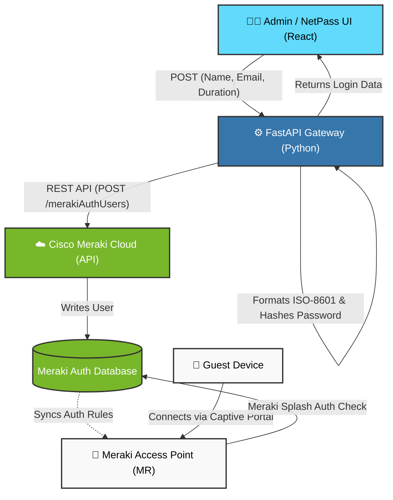

# NetPass: Enterprise Guest Provisioning Engine

NetPass is a full-stack application designed to automate the secure provisioning of temporary wireless access via the Cisco Meraki Cloud API. It provides a React-based interface for network administrators to generate timed credentials, display Wi-Fi QR codes, and execute instant security revocations.

## System Architecture

## Data Flow Explained

| Step | From | To | What happens |
|---|---|---|---|
| 1 | Admin (React) | FastAPI Gateway | Guest details (name, email, duration) sent as POST request |
| 2 | Gateway | Gateway | Timestamp formatted to ISO-8601, bcrypt password generated |
| 3 | Gateway | Meraki Cloud | `POST /merakiAuthUsers` called with Cisco API key in header |
| 4 | Meraki Cloud | Auth Database | New guest identity written to Meraki's cloud database |
| 5 | Gateway | Admin (React) | Credentials returned to frontend for display |
| 6 | Auth Database | Access Point | Meraki automatically syncs auth rules to physical hardware |
| 7 | Guest Device | Access Point | Guest connects and hits the captive portal splash page |
| 8 | Access Point | Auth Database | Meraki verifies credentials via splash auth and grants access |

> **Note:** Steps 6–8 occur entirely within Meraki's ecosystem. The NetPass backend has no involvement after Step 5 — this is the core advantage of Meraki's cloud-managed architecture.

## Authentication Note

This system uses **Meraki Splash Page Authentication** via the `merakiAuthUsers` API — not 802.1X/RADIUS. Splash auth enforces per-identity session management natively on the Meraki cloud without requiring a RADIUS server or EAP supplicant configuration on the guest device.
